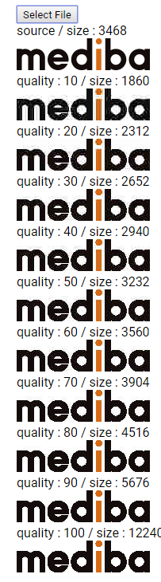

# jpg 圧縮の比較ツールが出来ていた

```AA
　　　　　　　　　　　　　　　　　　　　　　　　　　　　　　やつを追う前に言っておくッ！
　　　　　　　　　　　　　　　　　　　　　　おれは今やつのスタンドをほんのちょっぴりだが体験した
　　　　　　　　　　　　　　　　　　い…いや…体験したというよりはまったく理解を超えていたのだが……
　　　　　　　　 ,. -‐'''''""¨¨¨ヽ
　　　　 　 　 (.＿＿_,,,... -ｧァﾌ|　　　　　　　　 　あ…ありのまま 今　起こった事を話すぜ！
　 　 　 　 　 |i i|　 　 }!　}} /／|
　　　　 　 　 |l､{　 　j}　/,,ｨ//｜　　　　　　　『Dart2でCLIツールを作っていたと思ったら
　　　　　　　 i|:!ヾ､_ﾉ／ u {:}//ﾍ　　　　　　　　　　　　　　いつのまにかAngularDart5になっていた』
　　　　　　　 |ﾘ u' }　 ,ﾉ　_,!V,ﾊ |
　　 　 　 ／´fト､_{ﾙ{,ィ'ｅﾗ　, ﾀ人　　　　　　な…　何を言ってるのか　わからねーと思うが
　　　　 /' 　 ヾ|宀| {´,)⌒`/ |<ヽﾄiゝ　　　　　　 おれも何をされたのかわからなかった…
　　　　,ﾞ　 ／ )ヽ iLﾚ 　u' |　| ヾｌﾄﾊ〉
　　 　 |／_／　 ﾊ !ニ⊇　'／:} 　V:::::ヽ　　　　　　　　頭がどうにかなりそうだった…
　　　 /／ 二二二7'T'' ／u'　__ /:::::::/｀ヽ
　　　/'´r　-―一ｧ‐ﾞＴ´　'"´ ／::::／-‐ 　＼　　　　 催眠術だとか超スピードだとか
　　 / // 　 广¨´ 　/'　　 ／:::::／´￣｀ヽ ⌒ヽ　 そんなチャチなもんじゃあ　断じてねえ
　　ﾉ ' /　 ノ:::::`ー-､___／:::::／/ 　 　 　 ヽ}
_／｀丶　/::::::::::::::::::::::::::￣`ー-{:::...ｲ  もっと恐ろしいものの片鱗を味わったぜ…
```

出展 : https://dic.nicovideo.jp/a/%E3%81%82...%E3%81%82%E3%82%8A%E3%81%AE%E3%81%BE%E3%81%BE%20%E4%BB%8A%20%E8%B5%B7%E3%81%93%E3%81%A3%E3%81%9F%E4%BA%8B%E3%82%92%E8%A9%B1%E3%81%99%E3%81%9C%21

この記事は [mediba Advent Calendar 2018](https://adventar.org/calendars/3315) 二日目の記事です
いいのかのっけからこんなふざけてて....

## 自己紹介

メリークリスマスまで 3 週間ちょいです、いかがお過ごしでしょうか
コミュニケーションデザイン本部 想像部 アプリ開発グループの 佐藤禎章と申します
本業としては、Android/iOS のネイティブアプリの構築をするメンバーのお手伝いをやっています

# 今回作ったもの

今回出来ていたものは、 _JPG 画像の圧縮率を比較できる SPA_ です
https://github.com/medi-y-sato/imageComplesser

## なんでこんなものが出来たのか

- 別件でファイル加工処理のバッチを Perl で作っていた
- でも今どきバッチ処理程度で Perl 環境インストールしてもらうのも大変だよなあ、モジュールとか面倒だし、と Perl を思い直した
- そこで node/typescript で書いてみたが、割とファイルの取扱がめんどくさかった
- そんな折に Dart2 と Flutter のニュースを耳にした
- 調べてみたら [pub](https://pub.dartlang.org/)というパッケージ管理の仕組みが(-npm の再発明かと思ったけど-)ちゃんとしてて、Web サーバ側やローカルでの処理もちゃんと書けそうに見えた
- ので、ファイル加工のバッチを Dart2 で書いたら、すごいあっさりさっぱり書けてびっくりした

※ このバッチ自体はちょっと機密なものなので公開できないです、ごめんなさい
※ やってることはファイル読んで RegExp の match や replace ゴリゴリする、よくある奴です

で、このお手軽さを誰かに伝えたい、と思い、 *特定ディレクトリにある画像全部を PNG の圧縮レベル最大でコンバートし直したらどれだけ小さくなるかツール*を作ってみたのですね
そしたら全然変わんなかったんです、みんなちゃんと最大レベルで圧縮してやんの

なんか悔しくなったので、画像ごとに jpg の圧縮レベルを変えて画像を沢山生成してみたら、意外と面白い結果になったのですね
自然画だったらクオリティ 50%くらいに落としても結構違いが分からないんだなー、とか、その割に容量あんまり変わらないんだなー、とか

で、ファイル生成自体は簡単に出来るんですけど、並べて比べるのが面倒だったんですね
Finder とか Explorer でサムネイル表示にして見比べて、とかやる必要があったので
だったらこの比較をする Web ページを生成しちゃえばいいじゃん、と思いまして、作り始めました
それでページ精製方法を考えたのですが、真面目に HTML 吐き出すよりはフレームワーク使ったほうが楽だよなー、と思いましてちょっと調べたら、あるじゃないですか [AngularDart](https://webdev.dartlang.org/angular)ってのが
以前 [ionic を扱っていた](https://qiita.com/medi-y-sato/items/9d8f97cdbb663fc48e44)こともあって Angular は分かっているので、 ~~昔打った篠塚~~ 昔取った杵柄とばかりにさくっと表示させてみました



ロゴみたいなのはやっぱり PNG が強い、というか JPG 弱いんですね

## で、ここまでやって気づいたのですが

**全然 Dart2 の強みとか活かしてない....**
